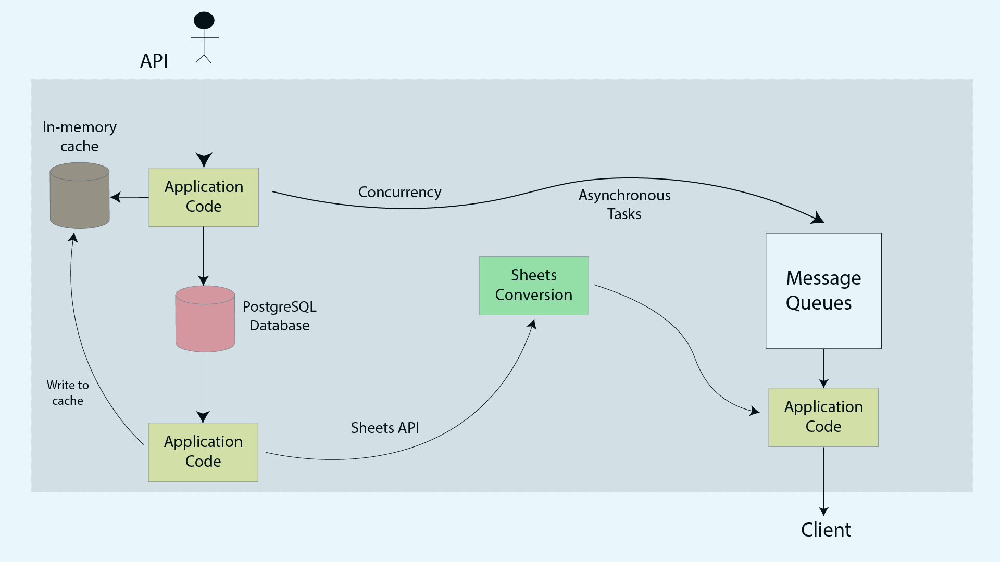
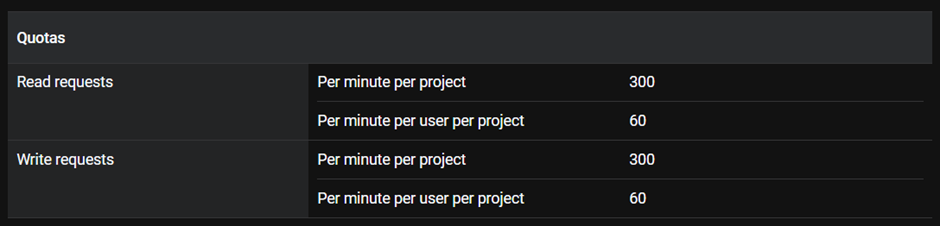

# About Daisy

A data collection platform that is being used by customers in 50+ countries in over 250
organizations and has powered data collection for over 11 million responses. Its features include team management, multilingual forms, and offline data collection. Customers use this platform to power their most critical activities — from governments delivering vaccines to small business owners managing their daily inventory, to a zoo monitoring a rare wildlife species.

The lifecycle of data collection via this platform does not end with the submission of a
response. There is usually some post-submission business logic that the platform needs to
support over time. The use case for which we solve in this codebase is -

_A very common need for organizations is wanting all their data onto Google Sheets,
wherein they could connect their CRM, and also generate graphs and charts offered
by Sheets out of the box. In such cases, each response to the form becomes a row in
the sheet, and questions in the form become columns_

# Directory Structure
- cmd
- database
- models
- sheets

_cmd_ contains the entry point of our application code where all the logic related to API is implemented. _database_ contains the logic for opening a connection with our postgres database to store forms, questions, responses and answers. _models_ consists of defined structs of our database tables which is provided to _cmd_ for storing and updating data. _sheets_ contains logic related to fetching data from our postgres server and making the data available on google sheets through Google Sheets API. 

# Forms API
The forms API allows us to create and fetch forms along with posting questions and retrieving answers
## API Routes
    - /create_form          allows us to create a form with questions
	- /get_form             allows us to fetch a form
	- /get_ques             allows us to fetch questions
	- /create_ques          allows us to create questions
	- /get_all_responses    allows us to fetch a list of all responses
	- /get_response         allows us to fetch the answer of a question

## Schemas
```
CREATE TABLE form {
    id SERIAL PRIMARY KEY
    title TEXT NOT NULL
    description TEXT
    created_at DATETIME
}

CREATE TABLE question {
    id SERIAL PRIMARY KEY
    form_id SERIAL
    question_text TEXT NOT NULL
    question_order INT
    created_at DATETIME
}

CREATE TABLE formResponse {
    id SERIAL PRIMARY KEY
    form_id SERIAL
    responded_at DATETIME
}

CREATE TABLE response {
    id SERIAL PRIMARY KEY
    response_id SERIAL
    question_id SERIAL
    answer TEXT NOT NULL
}
```

### Flow Diagram



# Google Sheets API

Google Sheets API has following limitations and it needs to be handled in case of excessive requests from clients to server:

