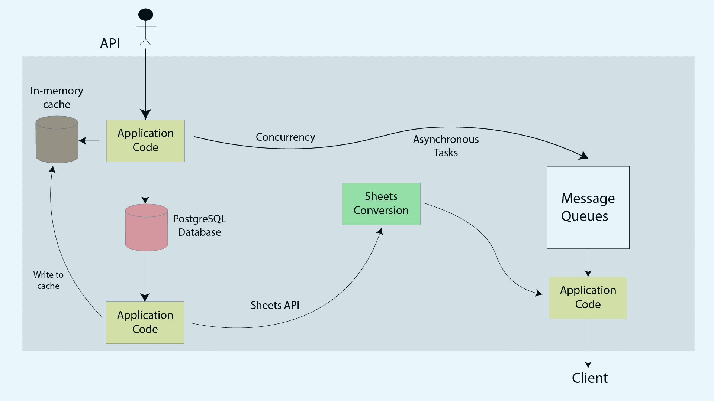
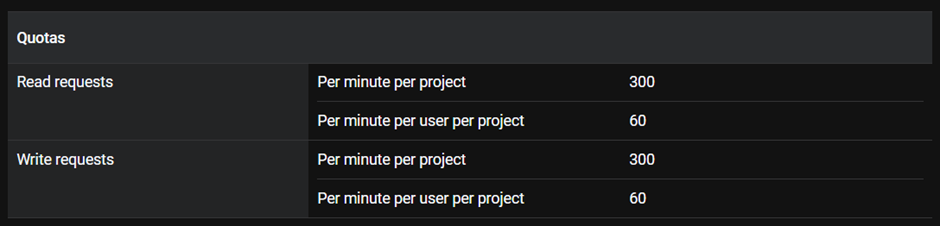

# About Daisy

A data collection platform that is being used by customers in 50+ countries in over 250
organizations and has powered data collection for over 11 million responses. Its features include team management, multilingual forms, and offline data collection. Customers use this platform to power their most critical activities — from governments delivering vaccines to small business owners managing their daily inventory, to a zoo monitoring a rare wildlife species.

The lifecycle of data collection via this platform does not end with the submission of a
response. There is usually some post-submission business logic that the platform needs to
support over time. The use case for which we solve in this codebase is -

_A very common need for organizations is wanting all their data onto Google Sheets,
wherein they could connect their CRM, and also generate graphs and charts offered
by Sheets out of the box. In such cases, each response to the form becomes a row in
the sheet, and questions in the form become columns_

# Directory Structure
- cmd
- database
- models
- sheets

_cmd_ contains the entry point of our application code where all the logic related to API is implemented.
_database_ contains the logic for opening a connection with our postgres database to store forms, questions, responses and answers.
_models_ consists of defined structs of our database tables which is provided to _cmd_ for storing and updating data.
_sheets_ contains logic related to fetching data from our postgres server and making the data available on google sheets through Google Sheets API. 

# Forms API
The forms API allows us to create and fetch forms along with posting questions and retrieving answers
## API Routes
    - /create_form          allows us to create a form with questions
	- /get_form             allows us to fetch a form
	- /get_ques             allows us to fetch questions
	- /create_ques          allows us to create questions
	- /get_all_responses    allows us to fetch a list of all responses
	- /get_response         allows us to fetch the answer of a question

## Schemas
```
CREATE TABLE form {
    id SERIAL PRIMARY KEY
    title TEXT NOT NULL
    description TEXT
    created_at DATETIME
}

CREATE TABLE question {
    id SERIAL PRIMARY KEY
    form_id SERIAL
    question_text TEXT NOT NULL
    question_order INT
    created_at DATETIME
}

CREATE TABLE formResponse {
    id SERIAL PRIMARY KEY
    form_id SERIAL
    responded_at DATETIME
}

CREATE TABLE response {
    id SERIAL PRIMARY KEY
    response_id SERIAL
    question_id SERIAL
    answer TEXT NOT NULL
}
```

## Flow Diagram



# Google Sheets API

Google Sheets API has following limitations and it needs to be handled in case of excessive requests from clients to server:



# System Design
Eventual consistency is what the clients expect as an outcome of this feature, making sure
no responses get missed in the journey. This solution is failsafe, eventually recovers from circumstances like power/internet/service outages, and scales to cases like millions of responses across hundreds of forms for an organization.

## Database
Since forms, questions, responses and answers are inter-related to each other, a relational database is required to provide strong consistency and data accuracy. Data schemes have clear entities and relationships. Since answer fields may include extensive set of data types and other metadata, PostgreSQL is preferred over MySQL. The concurrency provided by PostgreSQL along with high scalability and strong adherence to SQL standards is also useful for a data collection platform serving for over 11 million responses.

## Architecture

Out of all the system design architectures available, we have chosen event driven architecture due to following reasons:

- The event router will connect different components of application code independently of each other, allowing them to be inter-operable, while also ensuring if one service has failure, other service won’t get affected.
- The event router allows for more precise development of different service by abstracting away the need for heavy coordination between them
- Auth function allows for different roles for consumers in event driven architecture, allowing for encryption and restriction policies to be implemented over different services
- Event-driven architectures are push based, meaning we only activate services when a need for it presents itself in the router. This allows for cost-cutting facilities by enabling less network bandwidth consumption, less CPU utilization, less idle feet capacity, and less SSL/TLS handshakes

Different databases allow for different ways of attaching handlers on different events. Concurrency provided by Go optimizes for use by PostgreSQL to provide concurrent writers, which means, we can deploy multiple copies of services without requiring locks or coordination between them. This can be achieved by using serverless architecture.
A serverless architecture can be optimized by using AWS, RDS, SQS and Lamda:
- Lamda is the core of serverless architecture which will copy retrieved data from RDS into Google Sheets after they’ve been supplied through SQS
- SQS retrieves and saves events even if they’re not executed by Lamda. It provides actions in a queue format to be executed by Lamda
- RDS is used to maintain relationships between forms, questions, responses and answers
- A serverless architecture will allow for cost savings by allowing services to be only executed when it’s in use
- A load balancer will allow for higher scalability and faster response time
A non serverless architecture will have a simple RDS, cache and application code hosted on an ec2 instances.

## Performance

The performance of our architecture is optimized by following factors:
- Our system will require low latency along with eventual consistency to be provided to the clients, therefore we’ll use Cache and CDN to check for already available data in the local memory and keep continuously checking for any updates in the database and update the cache accordingly.
- Writing to google sheets is a write heavy system and it can be improved for performance by the use of Message Queue for asynchronous processing. Concurrent writers can also be used.
- Our database will be ACID compliant by the use of a relational database allowing us to maintain relationships between forms, questions, responses and answers
- Horizontal scaling is preferred over vertical in case demand increases. Higher availability and throughput is determined by the use of a Load Balancer to distribute services to the nearest available device. A cookie is attached to save user credentials implementing the changes in sheets. To save the cookies, a common database is used to provide eventual consistency in case load balancer distributes user to another server.
- A rate limiter is used to prevent heavy load on the server and DOS attacks
- Data replication is used to prevent faults and become tolerant and durable. A master-slave architecture works perfectly for data replication and allows for eventual consistency of data between all the slaves and allowing for continuous performance even if a service becomes inoperable.
- A heartbeat is used for eventual check-ins between different devices to make sure they’re functional.
- Modular architecture allows for plug-and-play function for our API

## Failures, Attacks, Outages and System Health

We ensure proper functioning of our services and hardware (system health) along with software in the following way:

- Allowing data replication between different servers in master-slave architecture which allows continuous availability of data.
- Implementing heartbeat to check-in different systems to make sure they are functional.
- Allow for configurations to be rolled back immediately.
- Only implementing new versions on a certain subset of users so not all users are affected in case of failures.
- Installing proper log functions at every step so we know which service is not properly performing its function and allow for auditing of data in future.
- Log rotation should be implemented to fix size of our log files per service and number of log files in our architecture.
- Reverse proxies in front of our server will prevent clients from directly interacting with the server and thus prevent attacks
- All these functions make our system highly reliable in terms of failures, data protection, authorization, attacks and provides high scalability by sharding and load balancing requests.
- Tracking system resource usage in terms of CPU and memory will allow us to implement queue processing, database monitoring, query performance, resource usage, monitor network latency, storage and other relevant metrics which increases responses time to users and prevents future failures due to overload.
- Receiving notifications for database performance thresholds, high CPU usage, slow queries, export service failures, delays, failure of google sheets API integration, google sheet API quotas and limits.
- Bare metal metrics like disk storage, disk health, CPU, memory, network latency, disruption in servers, bandwidth, and overheating should be regularly kept in check for regular replacement of hardware and software components and their upgradation.

## Google Sheets API
 
In order to optimize for faster requests, it is recommended to not exceed 2MB request payload size. In case we exceed our per minute write requests, an error code is returned until the quota is refilled, therefore application code needs to handle that error code. This can be done by implementing a truncated exponential backoff algorithm to make sure devices don’t generate excessive loads.
